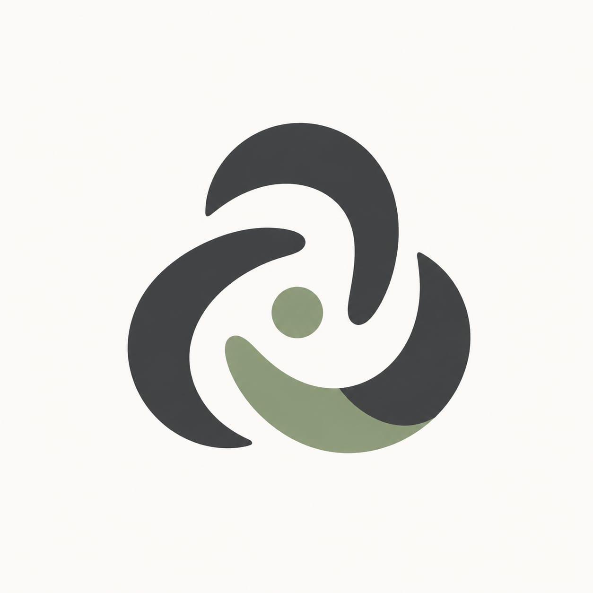

<div align="center">
  
  
  # AegisMDT AI Agent
  **Secure Multi-Agent Orchestration for Rare Oncology & Clinical Confidence**

  [](https://band.ai)
  [](https://fastapi.tiangolo.com)
  [](https://nextjs.org)
  [](https://featherless.ai)
  [](https://aimlapi.com)
  [](https://trychroma.com)
  [](https://doku.com)

  *Track 3: Regulated & High-Stakes Workflows - Band of Agents Hackathon
Build enterprise multi-agent systems with Band and Codeband*
</div>

<div align="center">
  
</div>

## 🔬 Overview & Vision

**AegisMDT** is an advanced, military-grade Virtual Medical Board (MDT - Multi-Disciplinary Team) prototype built specifically for the AI Hackathon by lablab.ai. 

In high-stakes medical fields like Oncology, relying on a single AI model for diagnosis is incredibly dangerous due to "hallucinations". AegisMDT solves this by deploying a **Swarm of Specialized AI Agents**. Rather than one model generating a generic answer, our specialized agents (Pathologist, Oncologist, Clinical Trial Matcher) rigorously debate the patient's data, cross-examine each other's findings, and are forced by an AI Moderator to reach a unified, high-confidence clinical consensus via the **Iterative Consensus Ensemble (ICE) Protocol**.

## ✨ Key Features & Technical Highlights

- **Iterative Consensus Ensemble (ICE)**: If any agent expresses low confidence, or if two agents output conflicting prognoses, the AI Moderator rejects the conclusion and forces a multi-agent debate. This drastically reduces AI hallucinations in high-stakes environments.
- **Agentic Web Search (RAG) & Memory**: Using ChromaDB, agents autonomously query the Semantic Scholar / PubMed graph to ground their arguments in real, peer-reviewed medical literature.
- **Multi-Modal Vision Agent**: Doctors can upload microscopy or Whole Slide Images (WSI). The Pathology Agent analyzes both text and visual morphology simultaneously.
- **Human-in-the-Loop Steering**: AegisMDT never replaces the doctor. Clinicians can intervene mid-debate using the "Request Revision" feature to steer the AI's clinical direction or inject new context.
- **Enterprise-Grade Auth & Billing**: Deeply integrated with **DOKU Payment Gateway**. AegisMDT restricts the dashboard usage exclusively to users holding an active hospital subscription license.
- **Premium Medical SaaS UI/UX**: Designed with a clean, high-trust enterprise aesthetic featuring soft shadows, rounded interfaces, terminal-style live demo streams, and fully edge-to-edge tech stack marquees.

## 🧰 Tech Stack & Powered By

AegisMDT is built upon a constellation of cutting-edge AI technologies:

1. **Band SDK**: Powers the multi-agent orchestration. It provides the framework for agent-to-agent communication, enabling the Pathology, Oncology, and Moderator agents to debate securely.
2. **Featherless AI**: Hosts the heavy, specialized 32B parameter open-source models (like Qwen) used by our agents to process complex medical reasoning at lightning speed.
3. **AI/ML API**: Acts as our robust LLM gateway, providing access to diverse foundation models ensuring our agents never go offline during critical ICE protocols.
4. **ChromaDB**: The vector database handling our Retrieval-Augmented Generation (RAG). It stores embeddings of historical oncology cases and medical literature for the agents to recall instantly.
5. **DOKU**: The leading payment gateway driving our SaaS tiering structure (Clinic vs. Hospital Enterprise).
6. **Next.js & FastAPI**: The modern full-stack foundation providing a snappy React frontend and a highly concurrent Python backend via WebSockets.

## 🏗️ Architecture

AegisMDT consists of a separated decoupled architecture:
1. **Frontend**: Next.js 14, TailwindCSS, Framer Motion (for dynamic kinetic agent message bubbles and terminal simulators).
2. **Backend**: FastAPI, WebSockets (for real-time agent streaming), and DOKU Python SDK.
3. **Orchestrator**: Custom asynchronous Python event loop handling parallel agent tasks using Band SDK.
4. **Vector Store**: ChromaDB for latent memory and historical case RAG.

### The Agent Swarm Setup
- 🛡️ **Privacy Agent**: Strips PII and anonymizes patient data before it hits the network.
- 🔬 **Pathology Agent**: Analyzes morphology and genomic mutations.
- 📊 **Prognostication Agent**: Calculates IPSS-R risks and survival rates.
- 🧪 **Clinical Trial Agent**: Matches patient biomarkers with ongoing trials.
- ⚖️ **Moderator Agent**: Resolves conflicts and builds the final clinical consensus.

## 🚀 Quick Start (Local Deployment)

### Prerequisites
- Python 3.10+
- Node.js 18+
- API Keys: Featherless AI, AI/ML API, Band SDK, DOKU Merchant Credentials.

### 1. Backend Setup
```bash
cd backend
python -m venv venv
# Windows:
.\venv\Scripts\Activate.ps1
# Mac/Linux:
source venv/bin/activate

pip install -r requirements.txt

# Configure Environment Variables
cp .env.example .env
# Fill in your API Keys (Featherless, AI/ML API) and DOKU credentials in .env

# Run the Server
uvicorn main:app --reload --port 8000
```

### 2. Frontend Setup
```bash
cd frontend
npm install
npm run dev
```
Open [http://localhost:3000](http://localhost:3000) in your browser.

## 💳 Demo Flow & Testing
1. Go to `http://localhost:3000`.
2. Navigate to the **Pricing** page. Select the **Hospital** tier and click Subscribe via DOKU.
3. Complete the mock DOKU Payment flow. Your account will automatically upgrade.
4. Once in the dashboard, click **"Fill Demo Patient (BPDCN)"** to load a complex cancer case.
5. Submit the case and click **"Start ICE Demo"** to watch the agents debate in real-time via WebSockets!

