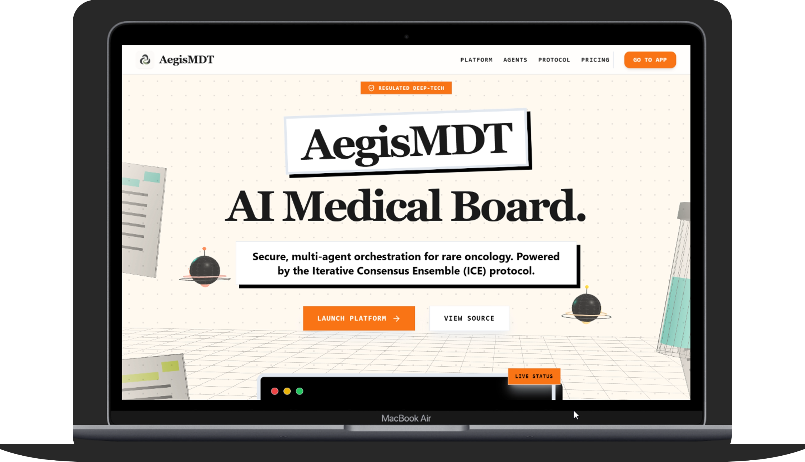

<div align="center">
  
  
  # AegisMDT AI Agent
  **Secure Multi-Agent Orchestration for Rare Oncology**

  [](https://band.ai)
  [](https://fastapi.tiangolo.com)
  [](https://nextjs.org)
  [](https://featherless.ai)
  [](https://doku.com)

  *Track 3: Regulated & High-Stakes Workflows*
</div>

<div align="center">
  
</div>

---

## 🔬 Overview

**AegisMDT** is an advanced, military-grade Virtual Medical Board (MDT - Multi-Disciplinary Team) prototype built for the AI Hackathon. It leverages a swarm of specialized AI agents to diagnose, prognosticate, and recommend clinical trials for highly complex and rare oncological cases (e.g., Blastic Plasmacytoid Dendritic Cell Neoplasm / BPDCN).

Instead of relying on a single AI model that can hallucinate, AegisMDT utilizes the **Iterative Consensus Ensemble (ICE) Protocol**, forcing multiple specialized AI agents (Pathologist, Oncologist, Clinical Trial Matcher) to debate and cite medical literature until a high-confidence consensus is reached.

## ✨ Key Features & Technical Highlights

- **Premium Medical SaaS UI/UX**: Designed with a clean, high-trust enterprise aesthetic featuring soft shadows, rounded interfaces, terminal-style live demo streams, and a focus on clinical efficiency. 
- **Iterative Consensus Ensemble (ICE)**: An AI Moderator forces agents to debate if their confidence scores are low or if their assessments conflict, drastically reducing AI hallucinations in high-stakes medical decisions.
- **Multi-Modal Vision Agent**: Upload microscopy/Whole Slide Images (WSI). The Pathology Agent analyzes both text and visual morphology.
- **Agentic Web Search (RAG)**: Agents autonomously query the Semantic Scholar / PubMed graph API to ground their arguments in real, peer-reviewed medical literature.
- **Human-in-the-Loop Steering**: Doctors are never replaced. They can intervene mid-debate using the "Request Revision" feature to steer the AI's clinical direction.
- **Enterprise-Grade Auth & Billing**: Integrated with **DOKU Payment Gateway** for subscription management. Hospitals cannot access the dashboard without an active enterprise subscription.
- **EMR Ready**: One-click generation of print-ready medical reports for Electronic Medical Records.

## 🏗️ Architecture

AegisMDT consists of a separated decoupled architecture:
1. **Frontend**: Next.js 14, TailwindCSS, Framer Motion (for dynamic kinetic agent message bubbles and terminal simulators).
2. **Backend**: FastAPI, WebSockets (for real-time agent streaming), and DOKU Python SDK.
3. **Orchestrator**: Custom asynchronous Python event loop handling parallel agent tasks using Band SDK.
4. **Vector Store**: ChromaDB for latent memory and historical case RAG.

### The Agent Swarm
- 🛡️ **Privacy Agent**: Strips PII and anonymizes patient data before it hits the network.
- 🔬 **Pathology Agent**: Analyzes morphology and genomic mutations.
- 📊 **Prognostication Agent**: Calculates IPSS-R risks and survival rates.
- 🧪 **Clinical Trial Agent**: Matches patient biomarkers with ongoing trials.
- ⚖️ **Moderator Agent**: Resolves conflicts and builds the final clinical consensus.

## 🚀 Quick Start (Local Deployment)

### Prerequisites
- Python 3.10+
- Node.js 18+
- API Keys: Featherless AI, Band SDK, DOKU Merchant Credentials.

### 1. Backend Setup
```bash
cd backend
python -m venv venv
# Windows:
.\venv\Scripts\Activate.ps1
# Mac/Linux:
source venv/bin/activate

pip install -r requirements.txt

# Configure Environment Variables
cp .env.example .env
# Fill in your FEATHERLESS_API_KEY and DOKU keys in .env

# Run the Server
uvicorn main:app --reload --port 8000
```

### 2. Frontend Setup
```bash
cd frontend
npm install
npm run dev
```
Open [http://localhost:3000](http://localhost:3000) in your browser.

## 💳 Demo Flow & Testing
1. Go to `http://localhost:3000`.
2. Click **Launch Platform** or **Login**.
3. Use the Google SSO Mock login. (Note: `dr.demo@hospital.org` is a VIP account with an auto-active subscription. Other emails will be redirected to the DOKU Payment Gateway).
4. Once in the dashboard, click **"Fill Demo Patient (BPDCN)"** to load a complex cancer case.
5. Submit the case and click **"Start ICE Demo"** to watch the agents debate in real-time!

## 🔒 Security & Privacy Notice
This is a hackathon prototype. While it features PII stripping mechanisms, do **not** upload real patient data (PHI) to this public iteration. 
